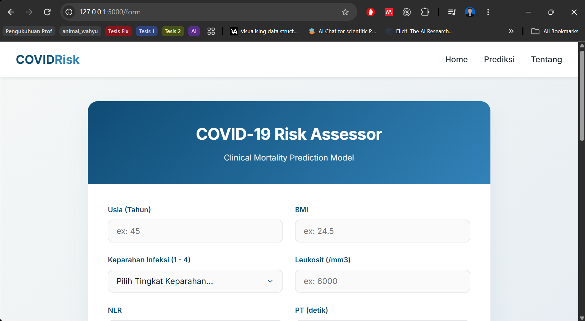
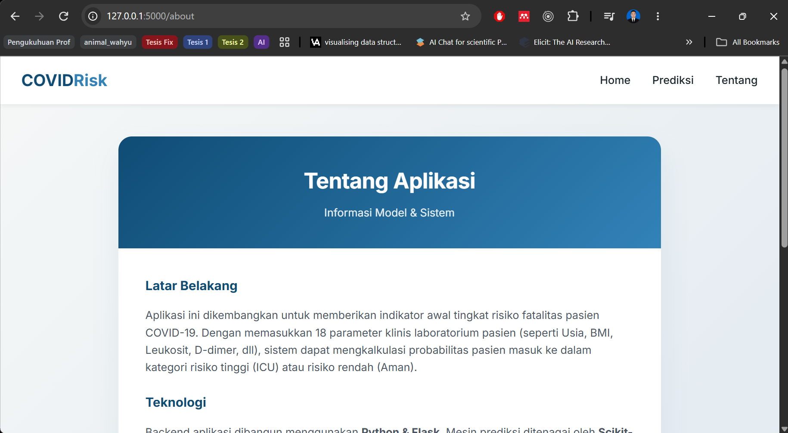

# COVID Mortality Prediction App

Ini adalah aplikasi web berbasis Flask yang digunakan untuk memprediksi tingkat kematian (mortality) akibat COVID-19 menggunakan Machine Learning. Model prediksi telah dilatih sebelumnya (menggunakan scikit-learn) dan disimpan dalam format `.pkl`.

## 📂 Struktur Direktori
- `app.py`: File utama aplikasi web (Flask).
- `requirements.txt`: Daftar library Python yang dibutuhkan.
- `covid_model.pkl`: Model machine learning yang telah dilatih.
- `scaler.save`: Skalar (StandardScaler) untuk normalisasi data.
- `templates/`: Folder berisi file HTML untuk antarmuka pengguna.
- `static/`: Folder untuk aset statis (CSS, JS, Images).

## 📸 Tampilan Aplikasi

**1. Halaman Utama (Landing Page)**  

**2. Formulir Prediksi Medis**  

**3. Hasil Keputusan Sistem**  

## ⚖️ Hak Kekayaan Intelektual
Aplikasi dan algoritma ini telah terdaftar dan dilindungi secara hukum.
- **Nomor Permohonan**: EC00202351268
- **Tanggal Permohonan**: 4 Juli 2023
